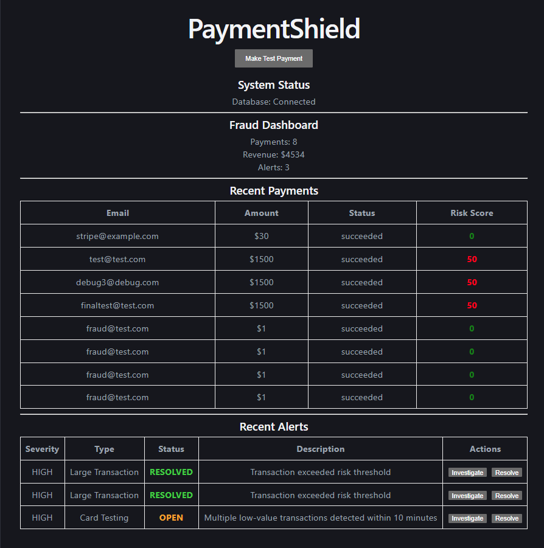
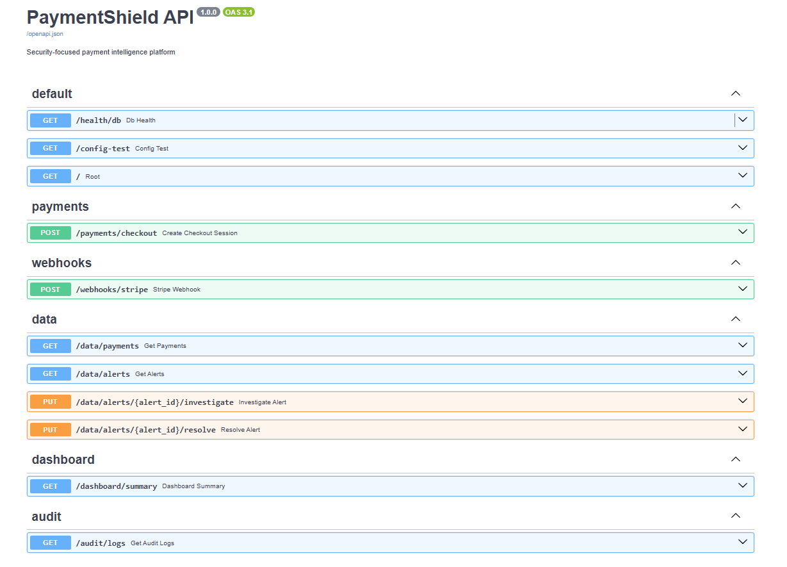
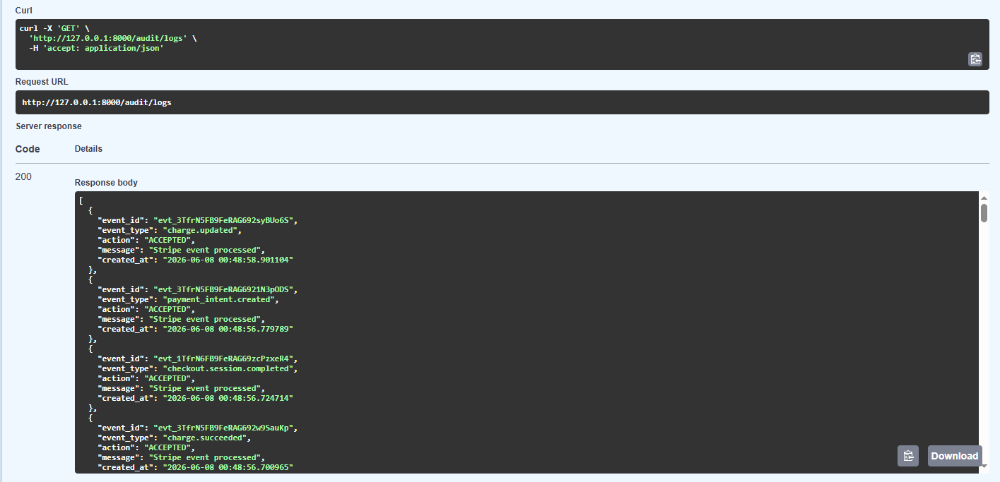
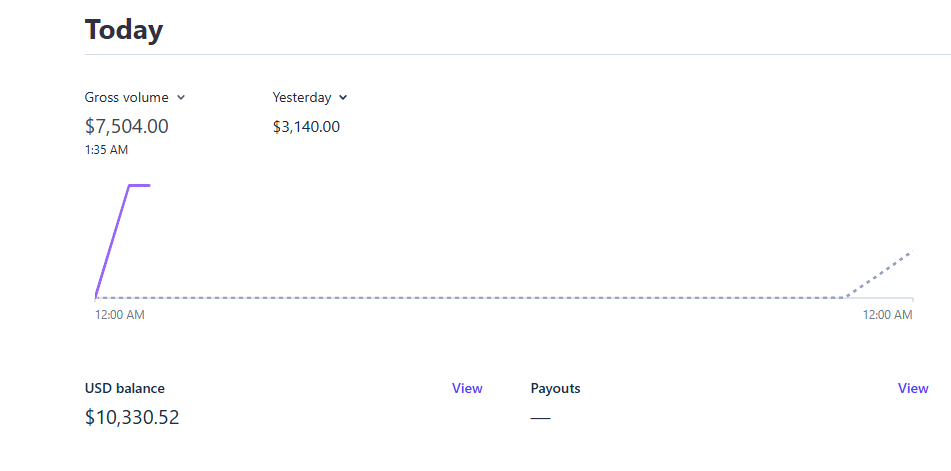
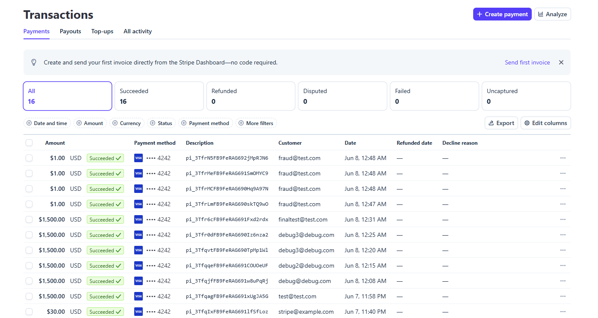

# PaymentShield

A Stripe-integrated fraud detection and investigation platform that monitors payment activity, analyzes risk, generates fraud alerts, and provides analyst workflows for investigating suspicious transactions.

---

## Overview

PaymentShield demonstrates how modern fintech platforms can securely process payment events while detecting suspicious behavior and supporting fraud investigations.

The platform integrates with Stripe Checkout and Stripe Webhooks, processes real-time payment events, calculates risk scores, generates fraud alerts, and tracks all activity through audit logging and replay-attack protection.

---

## Features

### Stripe Integration

- Stripe Checkout Sessions
- Stripe Payment Processing
- Stripe Webhook Processing
- Secure Webhook Signature Verification

### Fraud Detection

- Large Transaction Detection
- Card Testing Detection
- Risk Scoring Engine
- Real-Time Alert Generation

### Security Controls

- Webhook Signature Validation
- Replay Attack Protection
- Audit Logging
- Event Tracking

### Investigation Workflow

- OPEN Alerts
- INVESTIGATING Alerts
- RESOLVED Alerts

### Dashboard

- Revenue Monitoring
- Payment Monitoring
- Fraud Alert Dashboard
- Risk Score Visualization

---

## Architecture

```text
                    +----------------------+
                    |      React UI        |
                    |   Fraud Dashboard    |
                    +----------+-----------+
                               |
                               v
                    +----------------------+
                    |     FastAPI API      |
                    +----------+-----------+
                               |
         +---------------------+--------------------+
         |                     |                    |
         v                     v                    v
+----------------+   +----------------+   +----------------+
| Stripe Checkout|   |  Risk Engine   |   | Audit Logging  |
+----------------+   +----------------+   +----------------+
         |                     |                    |
         +---------------------+--------------------+
                               |
                               v
                    +----------------------+
                    |     PostgreSQL       |
                    +----------------------+
```

---

## Fraud Detection Logic

### Large Transaction Detection

Transactions are assigned risk scores based on payment amount.

| Amount | Risk Score |
|----------|----------|
| < $500 | 0 |
| >= $500 | 25 |
| >= $1000 | 50 |

High-risk transactions generate fraud alerts.

---

### Card Testing Detection

PaymentShield detects potential card-testing attacks by identifying:

- Multiple low-value payments
- Same customer email
- Within a short time window

When detected:

```text
Alert Type: Card Testing
Severity: HIGH
```

---

## Security Features

### Webhook Signature Verification

Every Stripe webhook is verified using Stripe's webhook signing secret before processing.

---

### Replay Attack Protection

Previously processed Stripe event IDs are stored and checked before processing.

Duplicate events are rejected.

---

### Audit Logging

Every webhook event is recorded with:

- Event ID
- Event Type
- Action
- Timestamp

---

## Alert Lifecycle

```text
OPEN
  ↓
INVESTIGATING
  ↓
RESOLVED
```

Fraud analysts can investigate and resolve alerts directly through the dashboard.

---

## Technology Stack

### Frontend

- React
- Vite
- Axios

### Backend

- FastAPI
- Python

### Database

- PostgreSQL
- SQLAlchemy

### Payment Platform

- Stripe Checkout
- Stripe Webhooks

### Infrastructure

- Docker
- Docker Compose
- Ubuntu WSL

---

## Screenshots

### Dashboard



---

### Swagger



---

### Audit Logs



---

### Stripe Dashboard




---


## Demo Workflow

### Scenario 1 - Large Transaction Detection

1. User initiates payment.
2. Stripe Checkout processes payment.
3. Webhook received.
4. Risk score calculated.
5. Large Transaction alert generated.
6. Alert displayed in dashboard.

---

### Scenario 2 - Card Testing Detection

1. Multiple low-value payments submitted.
2. Detection rules triggered.
3. Card Testing alert generated.
4. Alert displayed in dashboard.
5. Analyst investigates and resolves alert.

---

## Running Locally

### Backend

```bash
cd backend

source venv/bin/activate

uvicorn app.main:app --reload
```

### Frontend

```bash
cd frontend

npm install

npm run dev
```

### Database

```bash
docker compose up -d
```

---

## Resume Highlights

- Built a full-stack fraud detection platform using React, FastAPI, PostgreSQL, and Stripe APIs to process real-time payment events, calculate transaction risk scores, and generate analyst-facing fraud alerts.

- Implemented payment security controls including Stripe webhook signature verification, replay-attack protection, audit logging, and alert investigation workflows for secure event-driven payment monitoring.

---

## Future Enhancements

- Machine Learning Risk Models
- Device Fingerprinting
- IP Reputation Analysis
- Velocity-Based Fraud Detection
- Analyst Case Management

---

## Author

Samartha Suresh